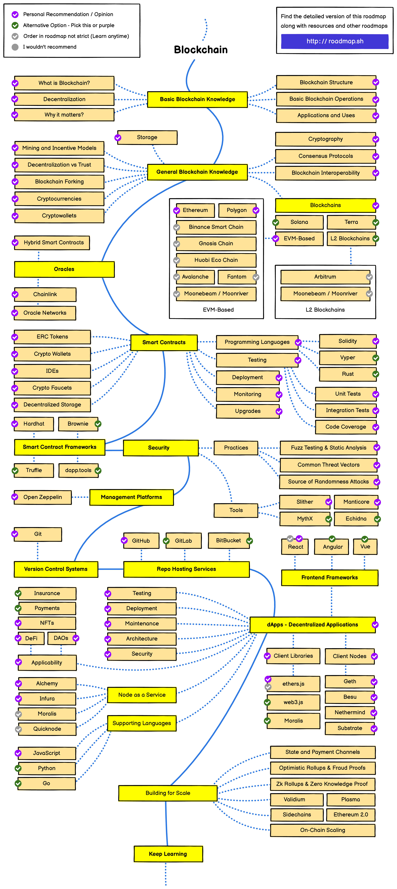

# Blockchain roadmap

## Basic Blockchain Knowledge

### What is Blockchain?

A blockchain is a decentralized, distributed, and oftentimes public, digital ledger consisting of records called blocks that is used to record transactions across many computers so that any involved block cannot be altered retroactively, without the alteration of all subsequent blocks.

- [Blockchain Explained](https://www.investopedia.com/terms/b/blockchain.asp)
- [What is decentralization?](https://aws.amazon.com/blockchain/decentralization-in-blockchain/)
- [How does a blockchain work?](https://youtu.be/SSo_EIwHSd4)
- [What Is a Blockchain? | Blockchain Basics for Developers](https://youtu.be/4ff9esY_4aU)

### Decentralization

In blockchain, decentralization refers to the transfer of control and decision-making from a centralized entity (individual, organization, or group thereof) to a distributed network. Decentralized networks strive to reduce the level of trust that participants must place in one another, and deter their ability to exert authority or control over one another in ways that degrade the functionality of the network.

- [What is decentralization?](https://aws.amazon.com/blockchain/decentralization-in-blockchain/)
- [What is Decentralization in Blockchain?](https://www.blockchain-council.org/blockchain/what-is-decentralization-in-blockchain/)

### Why it matters

The nature of blockchain allows for trustless systems to be built on top of it. Users don’t rely on a centralized group of people, such as a bank, to make decisions and allow transactions to flow through. Because the system is decentralized, users know that transactions will never be denied for non-custodial reasons.

This decentralization enables use-cases that were previously impossible, such as parametric insurance, decentralized finance, and decentralized organizations (DAOs), among a few. This allows developers to build products that provide immediate value without having to go through a bureaucratic process of applications, approvals, and general red tape.

- [Why Blockchain?](https://www.blockchain.education/blockchain101/blockchain)
- [What Is The Blockchain And Why Does It Matter?](https://www.forbes.com/sites/theyec/2020/05/18/what-is-the-blockchain-and-why-does-it-matter/)
- [Web3/Crypto: Why Bother?](https://continuations.com/post/671863718643105792/web3crypto-why-bother)
- [Why is Blockchain Important and Why Does it Matter](https://www.simplilearn.com/tutorials/blockchain-tutorial/why-is-blockchain-important)

### Blockchain Structure

The blockchain gets its name from its underlying structure. The blockchain is organized as a series of “blocks” that are “chained” together.

Understanding blockchain security requires understanding how the blockchain is put together. This requires knowing what the blocks and chains of blockchain are and why they are designed the way that they are.

- [Blockchain Architecture Basics: Components, Structure, Benefits & Creation](https://mlsdev.com/blog/156-how-to-build-your-own-blockchain-architecture)
- [Blockchain Architecture 101: Components, Structure, and Benefits](https://komodoplatform.com/en/academy/blockchain-architecture-101/)
- [Blockchain structure](https://resources.infosecinstitute.com/topic/blockchain-structure/)
- [Blockchain Basics | Coursera](https://www.coursera.org/lecture/blockchain-basics/blockchain-structure-5rj9Z)

### Basic Blockchain Operations

Operations in a decentralized networks are the responsibility of the peer participants and their respective computational nodes. These are specific for each type of blockchain.

- [Blockchain Basics: Structure, Operations, and the Bitcoin Blockchain](https://www.mlq.ai/blockchain-basics/)
- [Bitcoin blockchain transactions | Bitcoin Developer](https://developer.bitcoin.org/reference/transactions.html)
- [Ethereum blockchain transactions | ethereum.org](https://ethereum.org/en/developers/docs/transactions/)
- [Blockchain Basics | Coursera](https://www.coursera.org/lecture/blockchain-basics/basic-operations-OxILB)

### Application and uses of Blockchain technology

Blockchain applications go far beyond cryptocurrency and bitcoin. With its ability to create more transparency and fairness while also saving businesses time and money, the technology is impacting a variety of sectors in ways that range from how contracts are enforced to making government work more efficiently.

- [Blockchain Use Cases and Applications by Industry](https://consensys.net/blockchain-use-cases/)
- [Top 10 Real-World Applications Of Blockchain Technology](https://www.blockchain-council.org/blockchain/top-10-real-world-applications-of-blockchain-technology/)
- [Ethereum blockchain transactions | ethereum.org](https://ethereum.org/en/developers/docs/transactions/)
- [E34 Blockchain Applications and Real-World Use Cases Disrupting the Status Quo](https://builtin.com/blockchain/blockchain-applications)

## General Blockchain Knowledge

- [The Complete Course On Understanding Blockchain Technology](https://www.udemy.com/course/understanding-blockchain-technology/)
- [Blockchain Technology Explained](https://youtu.be/qOVAbKKSH10)

### Mining and incentive models

Mining is the process of adding transaction details to the Blockchain, like sender address, hash value, etc. The Blockchain contains all the history of the transactions that have taken place in the past for record purposes and it is stored in such a manner that, it can’t be manipulated.

An Incentive is basically a reward given to a Blockchain Miner for speeding up the transactions and making correct decisions while processing the complete transaction securely.

- [Blockchain Incentives to Miners](https://www.geeksforgeeks.org/blockchain-incentives-to-miners/)
- [Ethereum Consensus Mechanisms](https://ethereum.org/en/developers/docs/consensus-mechanisms/)
- [Solana Staking Rewards](https://docs.solana.com/implemented-proposals/staking-rewards)

### Decentralization vs trust

Blockchains, cryptocurrency, smart contracts, and oracles have emerged as new technologies for coordinating social and economic activities in a more secure, transparent, and accessible manner. Most importantly, these technologies are revealing the power of cryptographic guarantees—what we often call cryptographic truth—in restoring users’ trust in everyday interactions.

- [What Crypto Is Really About](https://blog.chain.link/what-crypto-is-really-about/)
- [Ethereum Consensus Mechanisms](https://ethereum.org/en/developers/docs/consensus-mechanisms/)
- [The Superiority of Cryptographic Truth](https://youtu.be/AEtBPbmIRKQ)

### Blockchain forking

A fork happens whenever a community makes a change to the blockchain’s protocol, or basic set of rules.

- [Blockchain Fork](https://en.wikipedia.org/wiki/Fork_(blockchain))
- [What is a fork?](https://www.coinbase.com/learn/crypto-basics/what-is-a-fork)
- [What Is a Hard Fork?](https://www.investopedia.com/terms/h/hard-fork.asp)

### Cryptocurrencies

A cryptocurrency, crypto-currency, or crypto is a digital currency designed to work as a medium of exchange through a blockchain, which is not reliant on any central authority, such as a government or bank, to uphold or maintain it.

- [What Is Cryptocurrency?](https://www.investopedia.com/terms/c/cryptocurrency.asp)
- [Cryptocurrency: What It Is and How It Works](https://www.nerdwallet.com/article/investing/cryptocurrency)
- [How Cryptocurrency actually works.](https://youtu.be/rYQgy8QDEBI)

### Cryptowallets

A cryptocurrency wallet is an application that functions as a wallet for your cryptocurrency.

- [What is a Cryptocurrency Wallet?](https://www.investopedia.com/terms/b/bitcoin-wallet.asp)
- [What is a Crypto Wallet? A Beginner’s Guide](https://crypto.com/university/crypto-wallets)

### Storage

Unlike a centralized server operated by a single company or organization, decentralized storage systems consist of a peer-to-peer network of user-operators who hold a portion of the overall data, creating a resilient file storage sharing system.

- [Blockchain Storage](https://www.techtarget.com/searchstorage/definition/blockchain-storage)
- [Decentralized Storage](https://ethereum.org/en/developers/docs/storage/)
- [How IPFS works](https://docs.ipfs.tech/concepts/how-ipfs-works/)

### Cryptography

Cryptography, or cryptology, is the practice and study of techniques for secure communication in the presence of adversarial behavior.

- [Cryptography](https://en.wikipedia.org/wiki/Cryptography)
- [What is Cryptography](https://www.synopsys.com/glossary/what-is-cryptography.html)
- [Asymmetric Encryption - Simply explained](https://youtu.be/AQDCe585Lnc)

### Consensus protocols

Consensus for blockchain is a procedure in which the peers of a Blockchain network reach agreement about the present state of the data in the network. Through this, consensus algorithms establish reliability and trust in the Blockchain network.

- [Consensus Mechanisms in Blockchain: A Beginner’s Guide](https://crypto.com/university/consensus-mechanisms-in-blockchain)
- [Consensus Mechanisms](https://ethereum.org/en/developers/docs/consensus-mechanisms/)
- [What Is a Consensus Mechanism?](https://www.coindesk.com/learn/what-is-a-consensus-mechanism/)

### Blockchain interoperability

The concept of “blockchain interoperability” refers to the ability of different blockchain networks to exchange and leverage data between one another and to move unique types of digital assets between the networks’ respective blockchains.

- [Cross-Chain Interoperability: What it Means for Blockchain](https://www.gemini.com/cryptopedia/why-is-interoperability-important-for-blockchain)
- [Blockchain Interoperability : Why Is Cross Chain Technology Important?](https://101blockchains.com/blockchain-interoperability/)
- [Blockchain Interoperability – Understanding Cross-Chain Technology](https://www.blockchain-council.org/blockchain/blockchain-interoperability/)

## Blockchains

Blockchain systems vary considerably in their design, particularly with regard to the consensus mechanisms used to perform the essential task of verifying network data.

- [Types of Blockchains: PoW, PoS, and Private](https://www.gemini.com/cryptopedia/blockchain-types-pow-pos-private)
- [Types of Blockchain](https://www.geeksforgeeks.org/types-of-blockchain/)

### Solana

Solana is a public blockchain platform with smart contract functionality. Its native cryptocurrency is SOL.

- [What is Solana, and how does it work?](https://cointelegraph.com/news/what-is-solana-and-how-does-it-work)
- [Solana Introduction](https://docs.solana.com/introduction)

### L2 blockchains

Layer-2 refers to a network or technology that operates on top of an underlying blockchain protocol to improve its scalability and efficiency.

This category of scaling solutions entails shifting a portion of Ethereum's transactional burden to an adjacent system architecture, which then handles the brunt of the network’s processing and only subsequently reports back to Ethereum to finalize its results.

- [Layer-1 and Layer-2 Blockchain Scaling Solutions](https://www.gemini.com/cryptopedia/blockchain-layer-2-network-layer-1-network)
- [Layer 2 - Binance Academy](https://academy.binance.com/en/glossary/layer-2)

#### Arbitrum

Arbitrum aims to reduce transaction fees and congestion by moving as much computation and data storage off of Ethereum's main blockchain (layer 1) as it can. Storing data off of Ethereum's blockchain is known as Layer 2 scaling solutions.

- [Arbitrum whitepaper](https://www.usenix.org/system/files/conference/usenixsecurity18/sec18-kalodner.pdf)
- [Inside Arbitrum](https://developer.offchainlabs.com/docs/Inside_Arbitrum)

#### Moonbeam Moonriver

Moonbeam is a Polkadot network parachain that promises cross-chain interoperability between the Ethereum and Polkadot . More specifically, Moonbeam is a smart contract platform that enables developers to move dApps between the two networks without having to rewrite code or redeploy infrastructure.

Moonriver is an incentivized testnet. It enables developers to create, test, and adjust their protocols prior to launching on Moonbeam. Moonbeam is the mainnet of the ecosystem.

- [About Moonbream](https://docs.moonbeam.network/learn/platform/networks/moonbeam/)
- [Moonbeam Vision](https://docs.moonbeam.network/learn/platform/vision/)

### EVM based

The Ethereum Virtual Machine (EVM) is a dedicated software virtual stack that executes smart contract bytecode and is integrated into each Ethereum node. Simply said, EVM is a software framework that allows developers to construct Ethereum-based decentralized applications (DApps). All Ethereum accounts and smart contracts are stored on this virtual computer.

Many blockchains have forked the Ethereum blockchain and added functionality on top, these blockchains are referred to as EVM-based blockchains.

- [What is Ethereum Virtual Machine?](https://moralis.io/evm-explained-what-is-ethereum-virtual-machine/)

#### Ethereum

Ethereum is a programmable blockchain platform with the capacity to support smart contracts, dapps (decentralized apps), and other DeFi projects. The Ethereum native token is the Ether (ETH), and it’s used to fuel operations on the blockchain.

The Ethereum platform launched in 2015, and it’s now the second largest form of crypto next to Bitcoin (BTC).

- [Ethereum whitepaper](https://ethereum.org/en/whitepaper/)
- [Intro to Ethereum](https://ethereum.org/en/developers/docs/intro-to-ethereum/)

#### Polygon

Polygon, formerly known as the Matic Network, is a scaling solution that aims to provide multiple tools to improve the speed and reduce the cost and complexities of transactions on the Ethereum blockchain.

- [Polygon whitepaper](https://polygon.technology/lightpaper-polygon.pdf)
- [Introduction to Polygon](https://wiki.polygon.technology/docs/develop/getting-started)

#### Binance Smart Chain

Binance Smart Chain (also known as BNB Chain) is a blockchain project initiated by Binance as a central piece of their cryptocurrency exchange, which is the largest exchange in the world in terms of daily trading volume of cryptocurrencies.

- [Binance whitepaper](https://www.exodus.com/assets/docs/binance-coin-whitepaper.pdf)
- [BNB Chain overview](https://www.binance.com/en/blog/all/bnb-chain-blockchain-for-exchanging-the-world-304219301536473088)

#### Gnosis Chain

Gnosis is a blockchain based on Ethereum, which changed the consensus model to PoS to solve major issues on the Ethereum mainnet. While the platform solves problems surrounding transaction fees and speed, it also means that the Gnosis chain is less decentralized, as it is somewhat reliant on the Ethereum chain.

- [Gnosis whitepaper](https://blockchainlab.com/pdf/gnosis_whitepaper.pdf)
- [Gnosis overview](https://developers.gnosischain.com/#gnosis-chain)

#### Huobi Eco Chain

Huobi's ECO Chain (also known as HECO) is a public blockchain that provides developers with a low-cost onchain environment for running decentralized apps (dApps) of smart contracts and storing digital assets.

- [Huobi Eco Chain whitepaper](https://www.hecochain.com/developer.133bd45.pdf)
- [Introduction to HECO Chain](https://docs.hecochain.com/#/)

#### Avalanche

Avalanche describes itself as an “open, programmable smart contracts platform for decentralized applications.” What does that mean? Like many other decentralized protocols, Avalanche has its own token called AVAX, which is used to pay transaction fees and can be staked to secure the network.

- [Avalanche whitepaper](https://assets.website-files.com/5d80307810123f5ffbb34d6e/6008d7bbf8b10d1eb01e7e16_Avalanche%20Platform%20Whitepaper.pdf)
- [Avalanche official website](https://www.avax.network/)

#### Fantom

Fantom is a decentralized, open-source smart contract platform that supports decentralized applications (dApps) and digital assets. It's one of many blockchain networks built as a faster, more efficient alternative to Ethereum, it uses the proof-of-stake consensus mechanism.

- [Fantom whitepaper](https://arxiv.org/pdf/1810.10360.pdf)
- [Fantom overview](https://docs.fantom.foundation/)

#### Moonbeam Moonriver

Moonbeam is a Polkadot network parachain that promises cross-chain interoperability between the Ethereum and Polkadot . More specifically, Moonbeam is a smart contract platform that enables developers to move dApps between the two networks without having to rewrite code or redeploy infrastructure.

Moonriver is an incentivized testnet. It enables developers to create, test, and adjust their protocols prior to launching on Moonbeam. Moonbeam is the mainnet of the ecosystem.

- [About Moonbream](https://docs.moonbeam.network/learn/platform/networks/moonbeam/)
- [Moonbeam Vision](https://docs.moonbeam.network/learn/platform/vision/)

## Oracles

A blockchain oracle is a third-party service that connects smart contracts with the outside world, primarily to feed information in from the world, but also the reverse. Information from the world encapsulates multiple sources so that decentralised knowledge is obtained.

- [Blockchain Oracle](https://en.wikipedia.org/wiki/Blockchain_oracle)
- [What Is a Blockchain Oracle?](https://chain.link/education/blockchain-oracles)

### Hybrid Smart Contracts

Hybrid smart contracts combine code running on the blockchain (on-chain) with data and computation from outside the blockchain (off-chain) provided by Decentralized Oracle Networks.

- [Hybrid Smart Contracts Explained](https://blog.chain.link/hybrid-smart-contracts-explained/)
- [A complete guide to understand hybrid smart contracts](https://www.leewayhertz.com/hybrid-smart-contracts/)

### Chainlink

Chainlink is a decentralized network of oracles that enables smart contracts to securely interact with real-world data and services that exist outside of blockchain networks.

- [What Is Chainlink? A Beginner’s Guide](https://blog.chain.link/what-is-chainlink/)
- [What Is Chainlink in 5 Minutes](https://www.gemini.com/cryptopedia/what-is-chainlink-and-how-does-it-work)

### Oracle Networks

By leveraging many different data sources, and implementing an oracle system that isn’t controlled by a single entity, decentralized oracle networks provide an increased level of security and fairness to smart contracts.

- [Decentralized Oracle Networks](https://medium.com/coinmonks/decentralized-oracle-networks-9fead28f5fe5)
- [A Beginner’s Guide To The Evolution Of Decentralized Oracle Networks](https://chainlinktoday.com/a-beginners-guide-to-the-evolution-of-decentralized-oracle-networks/)
- [Understanding Oracle Networks](https://coinmetro.com/blog/understanding-oracle-networks/)

## Smart Contracts

A smart contract is a computer program or a transaction protocol that is intended to automatically execute, control or document legally relevant events and actions according to the terms of a contract or an agreement.

- [Smart Contracts Introduction](https://www.blockchain.education/blockchain101/smart-contracts)
- [What Is a Smart Contract?](https://chain.link/education/smart-contracts)
- [Smart contracts - Simply Explained](https://youtu.be/ZE2HxTmxfrI)

### ERC Tokens

An ‘Ethereum Request for Comments’ (ERC) is a document that programmers use to write smart contracts on Ethereum Blockchain. They describe rules in these documents that Ethereum-based tokens must comply with.

While there are several Ethereum standards. These ERC Ethereum standards are the most well-known and popular: ERC-20, ERC-721, ERC-1155, and ERC-777.

- [What are Ethereum request for comments (ERC) Standards](https://dev.to/envoy_/ks-what-are-ethereum-request-for-comments-erc-standards-5f80)
- [ERC-20 Token Standard](https://ethereum.org/en/developers/docs/standards/tokens/erc-20/)

### Crypto Wallets

A cryptocurrency wallet is a device, physical medium, program, or service which stores the public and/or private keys for cryptocurrency transactions. In addition to this basic function of storing the keys, a cryptocurrency wallet more often also offers the functionality of encrypting and/or signing information.

- [What is a crypto wallet?](https://www.coinbase.com/learn/crypto-basics/what-is-a-crypto-wallet)
- [What is a Crypto Wallet? A Beginner’s Guide](https://crypto.com/university/crypto-wallets)

### IDEs

An integrated development environment is a software application that provides comprehensive facilities to computer programmers for software development. An IDE normally consists of at least a source code editor, build automation tools and a debugger.

- [Integrated Development Environments](https://ethereum.org/en/developers/docs/ides/)
- [Remix - Ethereum IDE & community](https://remix-project.org/)

### Crypto Faucets

A crypto faucet lets users earn small crypto rewards by completing simple tasks. The metaphor is based on how even one drop of water from a leaky faucet could eventually fill up a cup. There are various kinds of crypto faucets, including bitcoin (BTC), Ethereum (ETH), and BNB faucets.

Faucets are common in development environments where developers obtain testnet crypto in order develop and test their application prior to mainnet deployment.

- [What Is A Crypto Faucet?](https://academy.binance.com/en/articles/what-is-a-crypto-faucet)
- [What are crypto faucets and how do they work?](https://cointelegraph.com/news/what-are-crypto-faucets-and-how-do-they-work)

### Decentralized Storage

Decentralized storage is where data is stored on a decentralized network across multiple locations by users or groups who are incentivized to join, store, and keep data accessible. The servers used are hosted by people, rather than a single company. Anyone is free to join, they are kept honest due to smart contracts, and they are incentivized to participate via tokens.

- [What Is Decentralized Storage?](https://medium.com/@ppio/what-is-decentralized-storage-9c4b761942e2)
- [Decentralized Storage](https://ethereum.org/en/developers/docs/storage/)

### Programming Languages

Smart contracts can be programmed using relatively developer-friendly languages. If you're experienced with Python or any curly-bracket language, you can find a language with familiar syntax.

- [Smart Contract Languages](https://ethereum.org/en/developers/docs/smart-contracts/languages/)

#### Solidity

Solidity is an object-oriented programming language for implementing smart contracts on various blockchain platforms, most notably, Ethereum.

- [Solidity Programming Language](https://soliditylang.org/)
- [Solidity Tutorial](https://www.tutorialspoint.com/solidity/index.htm)

#### Vyper

Vyper is a contract-oriented, pythonic programming language that targets the Ethereum Virtual Machine (EVM).

- [Vyper Programming Language](https://vyper.readthedocs.io/en/stable/)
- [Learn Vyper in Y Minutes](https://learnxinyminutes.com/docs/vyper/)

#### Rust

Rust is a multi-paradigm, general-purpose programming language. Rust emphasizes performance, type safety, and concurrency. It is popular on smart contract chains Solana and Polkadot.

- [Rust Programming Language](https://www.rust-lang.org/)
- [How to write and deploy a smart contract in Rust](https://learn.figment.io/tutorials/write-and-deploy-a-smart-contract-on-near)

### Testing

Testing smart contracts is one of the most important measures for improving smart contract security. Unlike traditional software, smart contracts cannot typically be updated after launching, making it imperative to test rigorously before deploying contracts onto mainnet.

- [Testing Smart Contracts](https://ethereum.org/en/developers/docs/smart-contracts/testing/)
- [How to Test Ethereum Smart Contracts](https://betterprogramming.pub/how-to-test-ethereum-smart-contracts-35abc8fa199d)
- [Writing automated smart contract tests](https://docs.openzeppelin.com/learn/writing-automated-tests)

#### Unit Tests

Unit testing involves testing individual components in a smart contract for correctness. A unit test is simple, quick to run, and provides a clear idea of what went wrong if the test fails.

- [Smart Contracts Unit Testing](https://ethereum.org/en/developers/docs/smart-contracts/testing/#unit-testing)
- [Tips for Unit Testing Ethereum Smart Contracts in Solidity](https://betterprogramming.pub/a-few-tips-for-unit-testing-ethereum-smart-contract-in-solidity-d804062068fb)

#### Integration Tests

Integration tests validate interactions between multiple components. For smart contract testing this can mean interactions between different components of a single contract, or across multiple contracts.

- [Unit tests vs integration tests | Smart contract testing course](https://youtu.be/GxnX9k8i0zM)

#### Code Coverage

Code coverage is a metric that can help you understand how much of your source is tested. It's a very useful metric that can help you assess the quality of your test suite.

- [Testing Smart Contracts](https://ethereum.org/en/developers/docs/smart-contracts/testing/)
- [Smart Contract Code Coverage In Hardhat](https://medium.com/coinmonks/smart-contract-code-coverage-in-hardhat-d4a5ff6c9ba6)

### Deployment

Unlike other software, smart contracts don’t run on a local computer or a remote server: they live on the blockchain. Thus, interacting with them is different from more traditional applications.

- [Deploying Smart Contracts](https://ethereum.org/en/developers/docs/smart-contracts/deploying/)
- [Deploying and interacting with smart contracts](https://docs.openzeppelin.com/learn/deploying-and-interacting)

### Monitoring

Monitoring smart contracts allow their authors to view its activity and interactions based on generated transactions and events, allowing verification of the contract's intended purpose and functionality.

- [Monitoring Smart Contracts](https://consensys.github.io/smart-contract-best-practices/development-recommendations/solidity-specific/event-monitoring/)

### Upgrades

Smart contracts are immutable by default. Once they are created there is no way to alter them, effectively acting as an unbreakable contract among participants. However, for some scenarios, it is desirable to be able to modify them.

- [Upgrading Ethereum contracts](https://ethereum.org/en/developers/docs/smart-contracts/upgrading/)
- [Upgrading smart contracts](https://docs.openzeppelin.com/learn/upgrading-smart-contracts)
- [What are Upgradable Smart Contracts? Full Guide](https://moralis.io/what-are-upgradable-smart-contracts-full-guide/)
- [Upgrading your Smart Contracts | A Tutorial & Introduction](https://youtu.be/bdXJmWajZRY)

## Smart Contract Frameworks

Building a full-fledged dapp requires different pieces of technology. Software frameworks include many of the needed features or provide easy plugin systems to pick the tools you desire.

- [dApp Development Frameworks](https://ethereum.org/en/developers/docs/frameworks/)
- [A Definitive List of Ethereum Developer Tools - Frameworks](https://media.consensys.net/an-definitive-list-of-ethereum-developer-tools-2159ce865974#frameworks)
- [Top 10 Smart Contract Developer Tools You Need for 2022](https://medium.com/better-programming/top-10-smart-contract-developer-tools-you-need-for-2022-b763f5df689a)

### Hardhat

Hardhat is an Ethereum development environment. It allows users to compile contracts and run them on a development network. Get Solidity stack traces, console.log and more.

- [Hardhat Overview](https://hardhat.org/hardhat-runner/docs/getting-started#overview)
- [Build and Deploy Smart Contracts using Hardhat](https://youtu.be/GBc3lBrXEBo)

### Brownie

Brownie is a Python-based development and testing framework for smart contracts targeting the Ethereum Virtual Machine.

- [Brownie Overview](https://eth-brownie.readthedocs.io/)
- [Python and Blockchain: Deploy Smart Contracts using Brownie](https://youtu.be/QfFO22lwSw4)

### Truffle

A development environment, testing framework, and asset pipeline for blockchains using the Ethereum Virtual Machine (EVM), aiming to make life as a developer easier.

- [Truffle Overview](https://trufflesuite.com/docs/truffle/)
- [Truffle Tutorial for Beginners | Compile, Test & Deploy Smart contracts to any EVM Blockchain](https://youtu.be/62f757RVEvU)

### Foundry

Foundry is a smart contract development toolchain. Foundry manages your dependencies, compiles your project, runs tests, deploys, and lets you interact with the chain from the command-line and via Solidity scripts.

- [Foundry Overview](https://book.getfoundry.sh/)
- [Intro to Foundry](https://youtu.be/fNMfMxGxeag)

## Security

Smart contracts are extremely flexible, capable of both holding large quantities of tokens (often in excess of $1B) and running immutable logic based on previously deployed smart contract code. While this has created a vibrant and creative ecosystem of trustless, interconnected smart contracts, it is also the perfect ecosystem to attract attackers looking to profit by exploiting vulnerabilities

- [Smart Contract Security](https://ethereum.org/en/developers/docs/smart-contracts/security/)
- [Ethereum Smart Contract Security Recommendations](https://consensys.net/blog/developers/ethereum-smart-contract-security-recommendations/)

### Practices

Smart contract programming requires a different engineering mindset. The cost of failure can be high, and change can be difficult.

- [Ethereum Smart Contract Security Best Practices](https://consensys.github.io/smart-contract-best-practices/)
- [Smart Contract Security and Auditing 101](https://youtu.be/0aJfCug1zTM)

#### Fuzz Testing and Static Analysis

Fuzzing or fuzz testing is an automated software testing technique that involves providing invalid, unexpected, or random data as inputs to a smart contract.

Static analysis is the analysis of smart contracts performed without executing them.

- [Getting Started with Smart Contract Fuzzing](https://www.immunebytes.com/blog/getting-started-with-smart-contract-fuzzing/)
- [Solidity smart contract Static Code Analysis](https://lightrains.com/blogs/solidity-static-analysis-tools/#static-code-analysis)
- [Smart contract Fuzzing](https://youtu.be/LRyyNzrqgOc)

#### Common Threat Vectors

Smart contract audits enable developers to provide a thorough analysis of smart contract sets. The main goal of a smart contract audit is to detect and eliminate vulnerabilities, starting with the most common threat vectors.

- [Smart Contract Attack Vectors](https://github.com/kadenzipfel/smart-contract-attack-vectors)
- [Solidity Security: Comprehensive list of known attack vectors and common anti-patterns](https://blog.sigmaprime.io/solidity-security.html)
- [Blockchain Attack Vectors: Vulnerabilities of the Most Secure Technology](https://www.apriorit.com/dev-blog/578-blockchain-attack-vectors)

#### Source of Randomness Attacks

The security of cryptographic systems depends on some secret data that is known to authorized persons but unknown and unpredictable to others. To achieve this unpredictability, some randomization is typically employed. Modern cryptographic protocols often require frequent generation of random quantities. Cryptographic attacks that subvert or exploit weaknesses in this process are known as randomness attacks.

- [Smart Contract Randomness or ReplicatedLogic Attack](https://blog.finxter.com/randomness-or-replicatedlogic-attack-on-smart-contracts/)

### Tools

Blockchain and smart contract technology is faily new, therefore, you should expect constant changes in the security landscape, as new bugs and security risks are discovered, and new best practices are developed. Keeping track of this constantly moving landscape proves difficult, so using tools to aid this mission is important. The cost of failing to propertly secure smart contracts can be high, and because change can be difficult, we must make use of these tools.

#### Slither

Slither is a Solidity static analysis framework written in Python 3. It runs a suite of vulnerability detectors, prints visual information about contract details, and provides an API to easily write custom analyses. Slither enables developers to find vulnerabilities, enhance their code comprehension, and quickly prototype custom analyses.

- [Slither, the Solidity source analyzer](https://github.com/crytic/slither/blob/master/README.md)

#### Manticore

Manticore is a symbolic execution tool for analysis of smart contracts and binaries.

- [Manticore Docs](https://manticore.readthedocs.io/)

#### Mythx

MythX is a comprehensive smart contract security analysis tools developed by Consensys. It allows users to detect security vulnerabilities in Ethereum smart contracts throughout the development life cycle as well as analyze Solidity dapps for security holes and known smart contract vulnerabilities.

- [MythX Official Site](https://mythx.io/)
- [MythX Documentation](https://docs.mythx.io/)

#### Echidna

Echidna is a Haskell program designed for fuzzing/property-based testing of Ethereum smarts contracts. It uses sophisticated grammar-based fuzzing campaigns based on a contract ABI to falsify user-defined predicates or Solidity assertions.

- [Echidna: A Fast Smart Contract Fuzzer](https://github.com/crytic/echidna/blob/master/README.md)

## Management Platforms

Managing smart contracts in a production environment (mainnet) can prove difficult as users must keep track of different versions, blockchains, deployments, etc. Using a tool for this process eliminates a lot of the risk that comes with manual tracking.

### OpenZeppelin

OpenZeppelin Contracts helps you minimize risk by using battle-tested libraries of smart contracts for Ethereum and other blockchains. It includes the most used implementations of ERC standards.

- [OpenZeppelin Contracts](https://docs.openzeppelin.com/contracts/)

## Version Control Systems

Version control/source control systems allow developers to track and control changes to code over time. These services often include the ability to make atomic revisions to code, branch/fork off of specific points, and to compare versions of code. They are useful in determining the who, what, when, and why code changes were made.

- [Git](https://git-scm.com/)
- [Mercurial](https://www.mercurial-scm.org/)
- [What is Version Control?](https://www.atlassian.com/git/tutorials/what-is-version-control)

### Git

Git is a free and open source distributed version control system designed to handle everything from small to very large projects with speed and efficiency.

- [Version Control System Introduction](https://www.youtube.com/watch?v=zbKdDsNNOhg)
- [Git & GitHub Crash Course For Beginners](https://www.youtube.com/watch?v=SWYqp7iY_Tc)
- [Learn Git in 20 Minutes](https://youtu.be/Y9XZQO1n_7c?t=21)
- [Learn Git on the command line](https://github.com/jlord/git-it-electron)

## Repo Hosting Services

When working on a team, you often need a remote place to put your code so others can access it, create their own branches, and create or review pull requests. These services often include issue tracking, code review, and continuous integration features. A few popular choices are GitHub, GitLab, BitBucket, and AWS CodeCommit.

- [How to choose the best source code repository](https://bitbucket.org/product/code-repository)

### GitHub

GitHub is a provider of Internet hosting for software development and version control using Git. It offers the distributed version control and source code management functionality of Git, plus its own features.

- [GitHub Website](https://github.com/)

### GitLab

GitLab is a provider of internet hosting for software development and version control using Git. It offers the distributed version control and source code management functionality of Git, plus its own features.

- [GitLab Website](https://gitlab.com/)

### Bitbucket

Bitbucket is a Git based hosting and source code repository service that is Atlassian's alternative to other products like GitHub, GitLab etc

Bitbucket offers hosting options via Bitbucket Cloud (Atlassian's servers), Bitbucket Server (customer's on-premise) or Bitbucket Data Centre (number of servers in customers on-premise or cloud environment)

- [Bitbucket Website](https://bitbucket.org/product)

## dApps - Decentralized Applications

A decentralised application (dApp) is an application that can operate autonomously, through the use of smart contracts that run on a blockchain. Like traditional applications, dApps provide some function or utility to its users.

- [Introduction to dApps](https://ethereum.org/en/developers/docs/dapps/)
- [What Is a Dapp? Decentralized Apps Explained](https://www.coindesk.com/learn/what-is-a-dapp-decentralized-apps-explained/)

### Frontend Frameworks

Web frameworks are designed to write web applications. Frameworks are collections of libraries that aid in the development of a software product or website. Frameworks for web application development are collections of various tools. Frameworks vary in their capabilities and functions, depending on the tasks set. They define the structure, establish the rules, and provide the development tools required.

- [Web3 Frontend – Everything You Need to Learn About Building Dapp Frontends](https://moralis.io/web3-frontend-everything-you-need-to-learn-about-building-dapp-frontends/)
- [What is the difference between a framework and a library?](https://www.youtube.com/watch?v=D_MO9vIRBcA)
- [Which JS Framework is best?](https://www.youtube.com/watch?v=cuHDQhDhvPE)

#### React

React is the most popular front-end JavaScript library for building user interfaces. React can also render on the server using Node and power mobile apps using React Native.

- [React Website](https://reactjs.org/)

#### Angular

Angular is a component based front-end development framework built on TypeScript which includes a collection of well-integrated libraries that include features like routing, forms management, client-server communication, and more.

- [Official - Getting started with Angular](https://angular.io/start)

#### Vue.js

Vue.js is an open-source JavaScript framework for building user interfaces and single-page applications. It is mainly focused on front end development.

- [Vue.js Website](https://vuejs.org/)

### Testing

A key to building software that meets requirements without defects is testing. Software testing helps developers know they are building the right software. When tests are run as part of the development process (often with continuous integration tools), they build confidence and prevent regressions in the code.

Like traditional software, testing dApps involves testing the entire stack that makes up the dApp (backend, frontend, db, etc.).

- [What is Software Testing?](https://www.guru99.com/software-testing-introduction-importance.html)
- [Testing Pyramid](https://www.browserstack.com/guide/testing-pyramid-for-test-automation)
- [How to test dApps (decentralized applications)](https://rhian-is.medium.com/how-to-test-dapps-decentralized-applications-4662cf61db90)

### Deployment

Deploying a dApp involves deployment of all of its layers, generally through a management framework.

- [Tutorial for building an Ethereum DApp with Integrated Web3 Monitoring](https://www.moesif.com/blog/blockchain/ethereum/Tutorial-for-building-Ethereum-Dapp-with-Integrated-Error-Monitoring/)

### Maintenance

dApps can be harder to maintain because the code and data published to the blockchain is harder to modify. It’s hard for developers to make updates to their dapps (or the underlying data stored by a dapp) once they are deployed, even if bugs or security risks are identified in an old version.

### Architecture

Unlike Web2 applications, in Web3 there’s no centralized database that stores the application state or user identity, and there’s no centralized web server where the backend logic resides.

- [The Architecture of a Web 3.0 application](https://www.preethikasireddy.com/post/the-architecture-of-a-web-3-0-application)
- [Decentralized Applications Architecture: Back End, Security and Design Patterns](https://www.freecodecamp.org/news/how-to-design-a-secure-backend-for-your-decentralized-application-9541b5d8bddb/)

### Security

dApps face unique security challenges as they run on immutable blockchains. dApps are harder to maintain, and developers cannot modify or update their codes once deployed. Therefore, special consideration must be taken before putting it on the blockchain.

- [DAPP Security Standards](https://github.com/Dexaran/DAPP-security-standards/blob/master/README.md)
- [dApp Security Considerations](https://livebook.manning.com/book/building-ethereum-dapps/chapter-14/)
- [dApp Security:All You Need to Know](https://www.immunebytes.com/blog/dapp-security/#Benefits_of_DApps_Security)

### Applicability

dApps can be used for just about anything that requires two or more parties to agree on something. When the appropriate conditions are met, the smart contract will execute automatically. An important differentiation is that these transactions are no longer based on trust but they are rather based on cryptographically-backed smart contracts.

- [What Is a dApp? A Guide to Decentralized Applications](https://www.sofi.com/learn/content/what-is-a-dapp/)
- [Blockchain Use Cases and Applications by Industry](https://consensys.net/blockchain-use-cases/)
- [The real-world use cases for blockchain technology](https://roboticsandautomationnews.com/2022/05/20/the-real-world-use-cases-for-blockchain-technology/)

#### DeFi

Decentralized finance offers financial instruments without relying on intermediaries such as brokerages, exchanges, or banks by using smart contracts on a blockchain.

- [Decentralized Finance (DeFi) Definition](https://www.investopedia.com/decentralized-finance-defi-5113835)
- [What is DeFi?](https://www.coinbase.com/learn/crypto-basics/what-is-defi)

#### DAOs

A decentralized autonomous organization (DAO) is an emerging form of legal structure. With no central governing body, every member within a DAO typically shares a common goal and attempt to act in the best interest of the entity. Popularized through cryptocurrency enthusiasts and blockchain technology, DAOs are used to make decisions in a bottoms-up management approach.

- [What Is A DAO And How Do They Work?](https://consensys.net/blog/blockchain-explained/what-is-a-dao-and-how-do-they-work/)
- [Decentralized Autonomous Organization (DAO)](https://www.investopedia.com/tech/what-dao/)

#### NFTs

A non-fungible token (NFT) is a financial security consisting of digital data stored in a blockchain, a form of distributed ledger. The ownership of an NFT is recorded in the blockchain, and can be transferred by the owner, allowing NFTs to be sold and traded.

- [Non-Fungible Token (NFT)](https://www.investopedia.com/non-fungible-tokens-nft-5115211)
- [NFTs, explained](https://www.theverge.com/22310188/nft-explainer-what-is-blockchain-crypto-art-faq)
- [NFT Explained In 5 Minutes | What Is NFT? - Non Fungible Token](https://youtu.be/NNQLJcJEzv0)

#### Payments

Blockchain technology has the ability to eliminate all the tolls exacted by centralized organization when transferring payments.

- [How does blockchain impact global payments and remittances?](https://consensys.net/blockchain-use-cases/finance/#payments)
- [Smart Contract Use Cases - Payments](https://blog.chain.link/smart-contract-use-cases/#external-payments)

#### Insurance

Blockchain technology has the ability to automate claims functions by verifying real-world data through the use of an oracle. It also automates payments between parties for claims and thus lower administrative costs for insurance companies.

- [Smart Contract Use Cases - Insurance](https://blog.chain.link/smart-contract-use-cases/#insurance)
- [Top 7 Use Cases of Blockchain in the Insurance Industry](https://imaginovation.net/blog/blockchain-insurance-industry-examples/)

### Client libraries

You don't need to write every smart contract in your project from scratch. There are many open source smart contract libraries available that provide reusable building blocks for your project that can save you from having to reinvent the wheel.

#### Ethers.js

The ethers.js library aims to be a complete and compact library for interacting with the Ethereum Blockchain and its ecosystem. It was originally designed for use with ethers.io and has since expanded into a more general-purpose library.

- [Ethers.js Documentation](https://docs.ethers.io/)

#### Web3.js

web3.js is a collection of libraries that allow you to interact with a local or remote ethereum node using HTTP, IPC or WebSocket.

- [web3.js Documentation](https://web3js.readthedocs.io/)

#### Moralis SDK

A library that gives you access to the powerful Moralis Server backend from your JavaScript app.

- [Moralis SDK](https://github.com/MoralisWeb3/Moralis-JS-SDK/blob/main/README.md)

### Client Nodes

A blockchain is a distributed network of computers (known as nodes) running software that can verify blocks and transaction data. The software application, known as a client, must be run on your computer to turn it into a blockchain node.

#### Geth

Go Ethereum (Geth) is one of the three original implementations (along with C++ and Python) of the Ethereum protocol. It is written in Go, fully open source and licensed under the GNU LGPL v3.

- [Geth Documentation](https://geth.ethereum.org/docs/)

#### Besu

Besu is an Apache 2.0 licensed, MainNet compatible, Ethereum client written in Java.

- [Besu Ethereum Client](https://github.com/hyperledger/besu)

#### Nethermind

Nethermind is a high-performance, highly configurable full Ethereum protocol client built on .NET that runs on Linux, Windows, and macOS, and supports Clique, Aura, Ethash, and Proof-of-Stake consensus algorithms.

- [Nethermind Documentation](https://docs.nethermind.io/nethermind/)

#### Substrate

Substrate is a Software Development Kit (SDK) specifically designed to provide you with all of the fundamental components s blockchain requires so you can focus on crafting the logic that makes your chain unique and innovative.

- [Substrate Documentation](https://docs.substrate.io/quick-start/)

### Node as a Service (NaaS)

Running your own blockchain node can be challenging, especially when getting started or while scaling fast. There are a number of services that run optimized node infrastructures for you, so you can focus on developing your application or product instead.

- [Blockchain Node Providers and How They Work](https://www.infoq.com/articles/blockchain-as-a-service-get-block/)
- [Node as a Service - Ethereum](https://ethereum.org/en/developers/docs/nodes-and-clients/nodes-as-a-service/)

#### Alchemy

Alchemy is a developer platform that empowers companies to build scalable and reliable decentralized applications without the hassle of managing blockchain infrastructure in-house.

- [Alchemy official site](https://www.alchemy.com/)

#### Infura

Infura provides the tools and infrastructure that allow developers to easily take their blockchain application from testing to scaled deployment - with simple, reliable access to Ethereum and IPFS.

- [Infura official site](https://infura.io/)

#### Moralis

Moralis provides a single workflow for building high performance dapps. Fully compatible with your favorite web3 tools and services.

- [Moralis official site](https://moralis.io/)

#### Quicknode

QuickNode is a Web3 developer platform used to build and scale blockchain applications.

- [Quicknode official site](https://www.quicknode.com/)

### Supporting Languages

While the bulk of the logic in blockchain applications is handled by smart contracts, all the surrounding services that support those smart contracts (frontend, monitoring, etc.) are often written in other languages.

#### JavaScript

JavaScript, often abbreviated JS, is a programming language that is one of the core technologies of the World Wide Web, alongside HTML and CSS. It lets us add interactivity to pages e.g. you might have seen sliders, alerts, click interactions, and popups etc on different websites -- all of that is built using JavaScript. Apart from being used in the browser, it is also used in other non-browser environments as well such as Node.js for writing server-side code in JavaScript, Electron for writing desktop applications, React Native for mobile applications and so on.

- [W3Schools – JavaScript Tutorial](https://www.w3schools.com/js/)
- [The Modern JavaScript Tutorial](https://javascript.info/)
- [Eloquent Javascript - Book](https://eloquentjavascript.net/)

#### Python

Python is a well known programming language which is both a strongly typed and a dynamically typed language. Being an interpreted language, code is executed as soon as it is written and the Python syntax allows for writing code in functional, procedureal or object-oriented programmatic ways.

- [Python Website](https://www.python.org/)

#### Go

Go is an open source programming language supported by Google. Go can be used to write cloud services, CLI tools, used for API development, and much more.

- [Go Reference Documentation](https://go.dev/doc/)

## Building for Scale

Due to the limited number of transactions-per-second (TPS) built-in to blockchains, a number of alternative mechanism and technologies have emerged to aid the scaling of blockchain dApps.

### State and Payment Channels

State channels refer to the process in which users transact with one another directly outside of the blockchain, or ‘off-chain,’ and greatly minimize their use of ‘on-chain’ operations.

- [The Basics of State Channels](https://education.district0x.io/general-topics/understanding-ethereum/basics-state-channels/)
- [State Channels: An Introduction to Off-chain Transactions](https://www.talentica.com/blogs/state-channels-an-introduction-to-off-chain-transactions/)

### Optimistic Rollups and Fraud Proofs

‍Optimistic rollups are a layer 2 (L2) construction that improves throughput and latency on Ethereum’s base layer by moving computation and data storage off-chain. An optimistic rollup processes transactions outside of Ethereum Mainnet, reducing congestion on the base layer and improving scalability.

Optimistic rollups allow anyone to publish blocks without providing proofs of validity. However, to ensure the chain remains safe, optimistic rollups specify a time window during which anyone can dispute a state transition.

- [How Do Optimistic Rollups Work (The Complete Guide)](https://www.alchemy.com/overviews/optimistic-rollups)

### Zero Knowledge Rollups and Zero Knowledge Proof

Zero-knowledge rollups (ZK-rollups) are layer 2 scaling solutions that increase the throughput of a blockchain by moving computation and state-storage off-chain.

- [Zero-Knowledge Rollups - Ethereum](https://ethereum.org/en/developers/docs/scaling/zk-rollups)
- [What are Zero-Knowledge Rollups (ZK-rollups)?](https://www.alchemy.com//blog/zero-knowledge-rollups)

### Validium

Validium is a scaling solution that enforces integrity of transactions using validity proofs like ZK-rollups, but doesn’t store transaction data on the Ethereum Mainnet. While off-chain data availability introduces trade-offs, it can lead to massive improvements in scalability

- [Validium - Ethereum](https://ethereum.org/en/developers/docs/scaling/validium/)

### Sidechains

A sidechain is a separate blockchain network that connects to another blockchain – called a parent blockchain or mainnet – via a two-way peg.

- [Sidechains - Ethereum](https://ethereum.org/en/developers/docs/scaling/sidechains/)
- [An Introduction to Sidechains](https://www.coindesk.com/learn/an-introduction-to-sidechains)

### Plasma

Plasma is a framework that allows the creation of child blockchains that use the main Ethereum chain as a layer of trust and arbitration. In Plasma, child chains can be designed to meet the requirements of specific use cases, specifically those that are not currently feasible on Ethereum.

- [Plasma Chains - Ethereum](https://ethereum.org/en/developers/docs/scaling/plasma/)

### Ethereum 2

Ethereum 2.0 marks a long-anticipated upgrade to the Ethereum public mainnet. Designed to accelerate Ethereum’s usage and adoption by improving its performance, Ethereum 2.0 implements Proof of Stake.

- [What Is Ethereum 2.0?](https://consensys.net/blog/blockchain-explained/what-is-ethereum-2/)
- [What Is Ethereum 2.0? Understanding The Merge](https://www.forbes.com/advisor/investing/cryptocurrency/ethereum-2/)

### On-Chain Scaling

On-chain scaling refers to any direct modification made to a blockchain, like data sharding and execution sharding in the incoming version of Ethereum 2.0. Another type of on-chain scaling would be a sidechain with two-way bridge to Ethereum, like Polygon.

- [Scaling - Ethereum](https://ethereum.org/en/developers/docs/scaling/)

## Summary

Keep Learning.

Thanks [roadmap](https://roadmap.sh/).